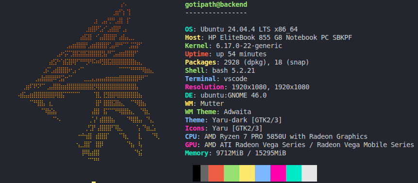

# Vex

<p align="center">
  
  
  
  
  
</p>

<p align="center">
  <b>Vex</b> is a fast, minimal, and modern system information tool for Linux, inspired by Neofetch and Fastfetch, written in Go.
</p>

---

## Features

- Minimal and clean output
- Fast startup time
- Ubuntu-focused design
- Gradient ASCII rendering
- Modular collector architecture
- Bold and colored labels
- Lightweight and dependency-free
- Easy to extend

---

## Preview

<p align="center">
  
</p>

---

## Installation

### Using Go

```bash
go install github.com/nihankhan/vex@latest
```

### From Source

```bash
git clone https://github.com/nihankhan/vex.git

cd vex

go build -o vex .
```

---

## Usage

```bash
vex
```

---

## Screenshots

> Add screenshots here

```md

```

---

## Benchmarks

| Tool      | Startup Time |
|------------|--------------|
| Vex        | ~10-20ms     |
| Neofetch   | ~100ms+      |

> Benchmarks may vary depending on hardware and system configuration.

---

## Architecture

```text
           +-------------------+
           |     Collectors     |
           |-------------------|
           | CPU / GPU / RAM   |
           | Kernel / Shell    |
           | WM / Theme        |
           +---------+---------+
                     |
                     v
           +-------------------+
           |     Renderer      |
           |-------------------|
           | Colors / Layout   |
           | ASCII Formatting  |
           +---------+---------+
                     |
                     v
           +-------------------+
           |      Output       |
           |-------------------|
           | Terminal Display  |
           +-------------------+
```

---

## Project Structure

```text
internal/
├── collector/   # system information collectors
├── renderer/    # terminal rendering and styling
├── logo/        # ascii logo providers
├── utils/       # helper utilities
└── app/         # application orchestration
```

---

## Philosophy

Vex focuses on:

- simplicity
- performance
- clean architecture
- terminal aesthetics

Unlike traditional system fetch tools, Vex is designed with a modular architecture that makes extending and maintaining the project straightforward.

---

## Roadmap

- [ ] Configuration support
- [ ] Multiple distro logos
- [ ] Parallel collectors
- [ ] Theme customization
- [ ] JSON output mode
- [ ] Plugin system
- [ ] Cross-distro support

---

## Contributing

Contributions are welcome.

```bash
git clone https://github.com/nihankhan/vex.git
```

Create a branch:

```bash
git checkout -b feature/my-feature
```

Commit your changes:

```bash
git commit -m "Add feature"
```

Push and open a pull request.

---

## Author

Made with Go and terminal obsession by [Nihan Khan](https://github.com/nihankhan) • [LinkedIn](https://www.linkedin.com/in/nihan-khan)